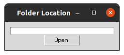

# Plot Analyzer

## Installation

To install, clone then run
```
pip install .
```

or

```
python -m pip install git+https://github.com/drk98/plotAnalyzer
```

## Running

To run, execute `plotAnalyzer`

This window will then appear



You can enter a path to a folder or a URL that contains figures. If no folder/URL is entered when "Open" is pressed, a file dialog will open to let you navigate to a folder.

The program will then open a new window displaying a figure. You can press one of the buttons under the figure to categorize it or print out all figures that are of that type. 
